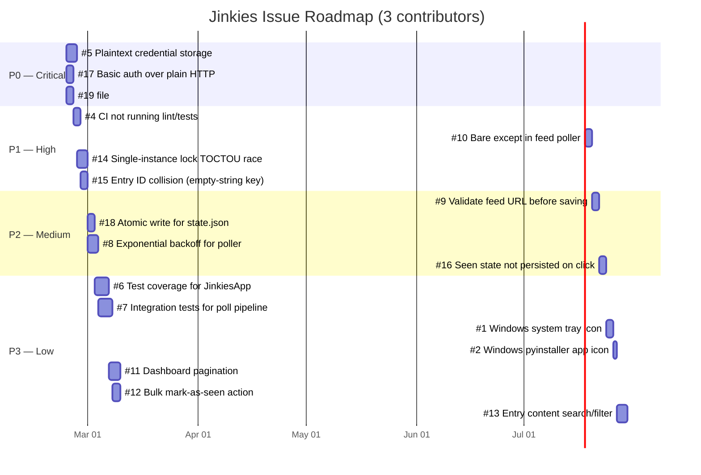

# Jinkies Roadmap

```mermaid
gantt
    title Jinkies Issue Roadmap (3 contributors)
    dateFormat  YYYY-MM-DD
    axisFormat  %b %d

    section P0 — Critical
    #5  Plaintext credential storage          :p0a, 2026-02-23, 3d
    #17 Basic auth over plain HTTP             :p0b, 2026-02-23, 2d
    #19 file:// URLs not blocked (SSRF)        :p0c, 2026-02-23, 2d

    section P1 — High
    #4  CI not running lint/tests              :p1a, after p0b, 2d
    #10 Bare except in feed poller             :p1b, after p0c, 2d
    #14 Single-instance lock TOCTOU race       :p1c, after p0a, 3d
    #15 Entry ID collision (empty-string key)  :p1d, after p1a, 2d

    section P2 — Medium
    #9  Validate feed URL before saving        :p2a, after p1b, 2d
    #18 Atomic write for state.json            :p2b, after p1c, 2d
    #8  Exponential backoff for poller          :p2c, after p1d, 3d
    #16 Seen state not persisted on click      :p2d, after p2a, 2d

    section P3 — Low
    #6  Test coverage for JinkiesApp           :p3a, after p2b, 4d
    #7  Integration tests for poll pipeline    :p3b, after p2c, 4d
    #1  Windows system tray icon               :p3c, after p2d, 2d
    #2  Windows pyinstaller app icon           :p3d, after p3c, 1d
    #11 Dashboard pagination                   :p3e, after p3a, 3d
    #12 Bulk mark-as-seen action               :p3f, after p3b, 2d
    #13 Entry content search/filter            :p3g, after p3d, 3d
```
