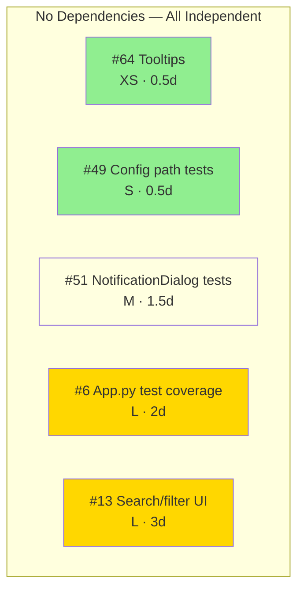
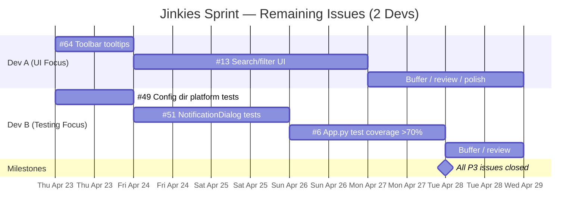
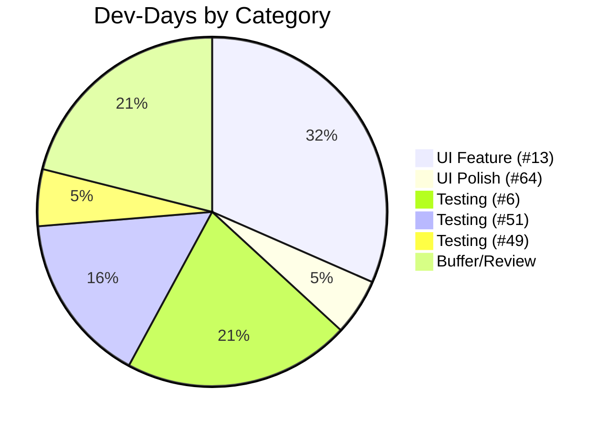

# Jinkies Sprint Plan — P3 Cleanup

**Date:** 2026-04-22
**Devs:** 2
**Duration:** 5 working days (Apr 23–28)

## Open Issues Summary

| # | Title | Type | Size | Complexity |
|---|-------|------|------|------------|
| **#13** | Entry content search/filter in dashboard | Feature/UI | **L** | New widget + real-time filtering + state mgmt |
| **#6** | JinkiesApp test coverage (>70%) | Testing | **L** | Mock-heavy, startup/shutdown/signals |
| **#51** | NotificationDialog tests | Testing | **M** | pytest-qt, animations, class-level state |
| **#49** | Config dir platform-specific tests | Testing | **S** | Parametrized, mock `sys.platform` |
| **#64** | Toolbar tooltip accessibility | Enhancement | **XS** | Add `setToolTip` calls to existing actions |

## Dependency Graph

## Gantt — 2 Devs, 5 Days

## Dev Assignment Rationale

**Dev A — UI track:**
- Start with #64 (tooltips) — quick win, warm up on dashboard code
- Then #13 (search/filter) — biggest feature, needs dashboard.py familiarity from #64
- Buffer for code review + edge case testing

**Dev B — Testing track:**
- Start with #49 (config paths) — small, isolated, quick win
- Then #51 (NotificationDialog) — medium complexity, pytest-qt
- Then #6 (app.py coverage) — largest test task, touches all subsystems
- Buffer for review

## Effort Breakdown

## Key Risks

| Risk | Mitigation |
|------|-----------|
| #13 search UI scope creep (content search = parsing HTML summaries) | Start with title-only filter, content search as follow-up |
| #6 app.py heavy Qt dependencies hard to mock | Use `pytest-qt`'s `qtbot`, mock subsystems at boundary |
| #51 animation timing flaky in CI | Use `QSignalSpy` + `waitUntil`, skip real timers |

## Quick Stats

- **3,199 LOC** source, **3,254 LOC** tests (1:1 ratio)
- After sprint: 3 testing gaps closed, 1 new feature, 1 accessibility fix
- All P0/P1/P2 already shipped — project in strong shape
